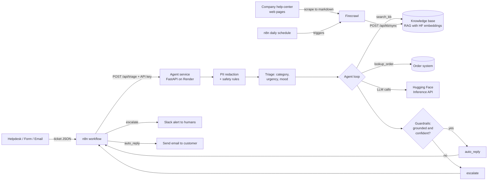

# AI Support Triage Agent


An agentic AI service that reads customer support tickets, checks company policy and the order system, and then either **answers the customer** or **hands the ticket to a human with a clear reason**. It is orchestrated with **n8n**, powered by **Hugging Face** models, kept up to date from the company's live website by **Firecrawl**, containerised with **Docker**, tested and built by **GitHub Actions**, and deployed on **Render**.

**Live demo:** https://YOUR-SERVICE.onrender.com &nbsp;|&nbsp; **API docs:** https://YOUR-SERVICE.onrender.com/docs
*(The free hosting plan sleeps when idle. The first request can take up to a minute.)*

<!-- Add a screenshot or GIF here: docs/demo.gif -->

---

## The business problem

Every company with customers runs a support inbox, and the same three things go wrong:

1. **Most tickets are repetitive.** "Where is my refund?", "I can't log in", "Where is my order?" are answered from the same handful of policy pages, but a human still reads and types each one.
2. **Urgent tickets get buried.** A legal threat or a fraud report sits in the same queue as a password question, and waits its turn.
3. **Naive AI chatbots are risky.** A bot that invents a refund policy or replies to a lawsuit threat creates legal and financial exposure. That is why many companies do not trust AI with customer replies.

## The solution

A triage agent that automates the safe majority and **routes everything risky to a person**:

| Situation | What the agent does |
|---|---|
| Question is covered by the knowledge base and confidence is high | Sends a reply grounded in the policy text |
| Customer gives an order ID | Looks the order up and uses the real status |
| Nothing in the knowledge base covers it (e.g. bulk pricing) | Escalates with the reason |
| Legal threat, fraud, hacked account, chargeback | Escalates immediately. **The LLM is never called** |
| Model is unsure, or its answer isn't backed by evidence | Escalates instead of guessing |
| The AI service is down | Escalates instead of dropping the ticket |

Every decision includes a step-by-step trace, so a support manager can audit why the agent did what it did.

### Live knowledge from the company website (Firecrawl)

Policies change: return windows, shipping fees, promo rules. If the agent's knowledge is a folder of files someone forgot to update, it confidently gives *outdated* answers, which is worse than no answer. So the knowledge base is fed by **[Firecrawl](https://www.firecrawl.dev)**, which scrapes the company's own help-center pages into clean markdown. An n8n schedule refreshes it every day, and every reply cites the exact URL it came from.

## Architecture



**Why n8n is separate from the agent:** the agent is the *brain* (reasoning and safety). n8n is the *business process* (where tickets come from, where alerts go). A non-developer on the support team can change the Slack channel, add Zendesk or Jira, or add an approval step in n8n without touching Python.

## Tech stack

| Layer | Choice | Why |
|---|---|---|
| LLM | Hugging Face Inference API (default `Qwen/Qwen2.5-7B-Instruct`, configurable) | Open model, no GPU to manage, fits a free hosting plan |
| Embeddings / RAG | `sentence-transformers/all-MiniLM-L6-v2` via Hugging Face | Finds relevant policy text so the LLM doesn't guess |
| Web knowledge | Firecrawl (`firecrawl-py`) | Turns live help-center pages into clean markdown for the knowledge base |
| Agent | Custom tool-using loop (search knowledge base, look up order, reply, escalate) | Small enough to read and explain, no framework magic |
| API | FastAPI + Pydantic | Typed, validated requests, automatic docs at `/docs` |
| Orchestration | n8n | Visual workflow the business can own |
| Container | Docker | Same runtime on laptop, CI and cloud |
| CI | GitHub Actions | Tests and Docker build on every push |
| Hosting | Render (Blueprint in `render.yaml`) | Deploys straight from GitHub |

## Cloud and production concepts this project demonstrates

| Concept | Where to find it |
|---|---|
| **Containerisation** | `Dockerfile` (non-root user, layer caching) |
| **Infrastructure as code** | `render.yaml` describes the whole deployment in Git |
| **CI/CD** | `.github/workflows/ci.yml` tests and builds on every push. Render auto-deploys `main` |
| **Secrets management** | `HF_TOKEN` and `API_KEY` are environment variables, never in the repo (`.env.example`, `sync: false`) |
| **Health checks** | `GET /health`, wired into Render's `healthCheckPath` |
| **Service authentication** | `POST /api/triage` requires an `X-API-Key` header (constant-time comparison) |
| **Abuse and cost protection** | Per-IP rate limit on the public demo endpoint, so nobody drains your AI quota |
| **Graceful degradation** | No embeddings, fall back to keyword search. No LLM, fail safe to a human. No token, run in demo mode |
| **Observability** | One structured log line per ticket, live counters at `/api/metrics` |
| **Data privacy** | Card numbers, emails and phone numbers are redacted *before* text is sent to a third-party AI API |
| **Prompt-injection defence** | Ticket text is treated as untrusted input in every prompt, and the guardrails don't depend on the model behaving |
| **Scheduled jobs** | `n8n/refresh-knowledge-base-workflow.json` re-syncs knowledge daily and alerts Slack on failure |
| **Ephemeral filesystems** | Render's free disk is wiped on restart, so `KB_SYNC_ON_STARTUP` re-scrapes on boot (background thread, so health checks still pass) |
| **Third-party API cost control** | `/api/kb/sync` needs an API key and refuses to run at all if none is configured, since it spends Firecrawl credits |
| **SSRF prevention** | Only URLs in `KB_SOURCE_URLS` are ever fetched. No endpoint accepts a URL from a caller |
| **Untrusted web content** | Scraped text is HTML-comment stripped (can't forge citations) and the prompt treats it as reference data, never instructions |
| **Safe data refresh** | A sync that returns nothing usable never wipes the existing knowledge (tested) |
| **Testing AI systems** | `tests/` uses a scripted fake LLM to prove the safety behaviour deterministically and for free |

## Run it locally

```bash
git clone https://github.com/YOUR-USERNAME/ai-support-triage-agent.git
cd ai-support-triage-agent
python -m venv .venv && source .venv/bin/activate      # Windows: .venv\Scripts\activate
pip install -r requirements-dev.txt

cp .env.example .env        # then edit .env and add your HF_TOKEN
export $(grep -v '^#' .env | xargs)    # Windows PowerShell: set the variables manually or use python-dotenv

pytest -q                                   # all tests should pass
uvicorn app.main:app --reload               # open http://localhost:8000
```

Optional: add `FIRECRAWL_API_KEY` and `KB_SOURCE_URLS` to `.env` to try live web knowledge (see [Connect Firecrawl](#connect-firecrawl)).

No Hugging Face token yet? Leave `HF_TOKEN` empty. The app runs in **demo mode** (keyword matching, no LLM) and shows a banner saying so.

Get a free token at https://huggingface.co/settings/tokens. If you create a *fine-grained* token, enable the permission to call Inference Providers.

Try the API directly:

```bash
curl -X POST http://localhost:8000/api/triage \
  -H "Content-Type: application/json" \
  -H "X-API-Key: change-me-to-a-long-random-string" \
  -d '{"subject":"Refund?","body":"I returned order ORD-1003 nine days ago. When do I get my money back?"}'
```

## Deploy: GitHub, then Render

**1. Push to GitHub**

```bash
git init
git add .
git commit -m "AI support triage agent"
git branch -M main
git remote add origin https://github.com/YOUR-USERNAME/ai-support-triage-agent.git
git push -u origin main
```

Open the **Actions** tab. The CI workflow should turn green. Copy the badge URL into the top of this README.

**2. Deploy on Render**

1. Create a free account at https://render.com and connect your GitHub.
2. **New, then Blueprint**, and pick this repository. Render reads `render.yaml` and proposes the service.
3. When asked for `HF_TOKEN`, paste your Hugging Face token. (`API_KEY` is generated for you. Copy it from the service's **Environment** tab, you'll need it in n8n.)
4. Click **Apply**. The first build takes a few minutes.
5. Open the `.onrender.com` URL. You should see the demo page with **no** "demo mode" banner, meaning the real LLM is active.
6. Put that URL at the top of this README.

From now on, every `git push` to `main` redeploys automatically.

## Connect Firecrawl

1. Create a free account at https://www.firecrawl.dev and copy your API key. Scraping costs roughly 1 credit per page, so keep the page list short.
2. Choose pages **you own or are allowed to scrape** (check the site's terms). A safe way to practise: publish a small fake company FAQ with GitHub Pages and scrape that.
3. Set these in `.env` (locally) or in the Render dashboard (deployed):

```
FIRECRAWL_API_KEY=fc-...
KB_SOURCE_URLS=https://YOUR-USERNAME.github.io/shopnova-help/returns,https://YOUR-USERNAME.github.io/shopnova-help/shipping
COMPANY_NAME=ShopNova
```

4. Try it from the command line, then start the app and look at the footer of the demo page:

```bash
python -m app.crawler        # scrapes the pages and writes kb/synced/web_*.md
uvicorn app.main:app         # footer now says "...including 2 web pages scraped with Firecrawl"
```

5. Or trigger it over HTTP (this is what n8n does):

```bash
curl -X POST https://YOUR-SERVICE.onrender.com/api/kb/sync -H "X-API-Key: YOUR_API_KEY"
```

6. Import `n8n/refresh-knowledge-base-workflow.json` into n8n, set the API key and Slack URL, and activate it. It refreshes the knowledge every morning and posts to Slack on success or failure.

**Good to know**

- Scraped files live in `kb/synced/` (git-ignored). Your hand-written files in `kb/` are never touched.
- `KB_CRAWL_LIMIT=1` scrapes exactly the pages listed. Set it higher (e.g. `10`) to treat each URL as a starting point and crawl linked pages too. That costs more credits.
- **On Render's free plan the disk is wiped on every restart**, so `render.yaml` sets `KB_SYNC_ON_STARTUP=true`. The service boots with the hand-written knowledge and adds the scraped pages a few seconds later. Every wake-up from sleep costs one credit per listed page.
- **Avoid two sources of truth.** The hand-written files in `kb/` are the demo company's policies. If your scraped website says something different (say 45 days to return instead of 30), the agent can retrieve both. Once you scrape your real site, delete or update the hand-written files that overlap with it.
- The prompts are written for the demo company "ShopNova". Set `COMPANY_NAME` to match the site you scrape.

## Connect n8n

The easiest route for a portfolio is to run n8n on your laptop and let it call your deployed agent.

```bash
docker compose up --build          # agent on :8000, n8n on :5678
```

1. Open http://localhost:5678 and create your local owner account.
2. **Workflows, Import from file**, then choose `n8n/support-triage-workflow.json`.
3. Open the **AI Triage Agent** node:
   - URL: keep `http://agent:8000/api/triage` for the local stack, or use `https://YOUR-SERVICE.onrender.com/api/triage` for the deployed one.
   - Replace `REPLACE_WITH_YOUR_API_KEY` with your `API_KEY`.
4. Open **Alert support team (Slack)** and paste a Slack Incoming Webhook URL (free to create), or delete that node and use Email instead.
5. Click **Execute workflow**, then send a test ticket to the *test* webhook URL shown on the Webhook node:

```bash
curl -X POST http://localhost:5678/webhook-test/support-ticket \
  -H "Content-Type: application/json" \
  -d '{"subject":"Charged twice","body":"I see two charges for my last order."}'
```

6. Activate the workflow to use the permanent `/webhook/support-ticket` URL.
7. **Record a 60 to 90 second screen capture** (webhook fires, the agent decides, Slack pings) and add it to `docs/`. Recruiters can't reach your laptop, so the video is your proof that n8n works.

> **Running n8n on Render instead?** You can (see the commented block in `render.yaml`), but n8n needs more memory and a persistent disk, so it requires a paid instance. For a portfolio, the local setup plus a recording is the better value.

## API reference

| Method | Path | Purpose |
|---|---|---|
| `POST` | `/api/triage` | Triage one ticket. Requires `X-API-Key`. Used by n8n |
| `POST` | `/api/demo` | Same, no key, rate limited. Used by the web page |
| `GET` | `/api/metrics` | Counters: total, auto-answered, escalated, average latency |
| `GET` | `/api/kb` | What the agent knows: sections, web pages, last sync result |
| `POST` | `/api/kb/sync` | Re-scrape the configured pages with Firecrawl. Requires `X-API-Key` |
| `GET` | `/health` | Liveness check, also reports `llm` or `demo` mode |
| `GET` | `/docs` | Interactive OpenAPI documentation |

Response fields: `action` (`auto_reply` or `escalate`), `category`, `urgency`, `sentiment`, `reply`, `confidence`, `reason`, `sources`, `trace`, `latency_ms`.

## Project layout

```
app/
  main.py        HTTP endpoints, auth, rate limit, metrics
  agent.py       Triage, agent loop, guardrails, fail-safe
  llm.py         Hugging Face chat + embeddings wrapper
  kb.py          RAG: chunking, embeddings search, keyword fallback
  crawler.py     Firecrawl sync: web pages to knowledge base files
  tools.py       Tools the agent can call
  static/        Demo web page
kb/              Company policy documents (the agent's knowledge)
n8n/             Importable n8n workflows (ticket triage, daily knowledge refresh)
tests/           Safety-behaviour tests (no network needed)
Dockerfile, render.yaml, docker-compose.yml, .github/workflows/ci.yml
```

## Honest limitations, and what production would add

This is a portfolio project. In a real company you would add:

- **Real integrations.** `lookup_order` reads a fake dictionary. In production it calls the order system's API, and n8n pulls tickets from Zendesk, Freshdesk or a shared inbox.
- **Persistence.** Metrics live in memory and reset on restart, and scraped knowledge is re-fetched on boot. Use Postgres (with `pgvector` for embeddings) and a dashboard (Grafana, Metabase).
- **Smarter refresh.** The sync replaces all scraped pages each time. Production would detect changed pages, keep version history, and let a human review policy changes before they go live.
- **An evaluation set.** Collect a few hundred labelled historical tickets, measure the *wrong-auto-reply rate* on them, and tune the confidence threshold. That number matters more than accuracy.
- **Human feedback loop.** Log when agents edit or reject a drafted reply and use it to improve the knowledge base.
- **Scale.** The service is stateless, so it can run several instances behind a load balancer. Move the rate limiter to Redis and put ticket processing behind a queue for high volume.
- **Compliance.** Regex redaction is a first layer only. Regulated industries need a proper PII detection service and a data-processing agreement with the model provider.

**How a company would measure success:** share of tickets resolved without a human, first-response time, the wrong-auto-reply rate (lower is better and most important), and cost per ticket.

## Talking about this project in interviews

**"Walk me through it."** Tickets arrive at an n8n webhook. n8n calls my FastAPI agent. The agent masks personal data, checks safety rules, classifies the ticket, then loops: it searches a knowledge base with embeddings or looks up an order, and drafts a reply. Guardrails check the reply is grounded and confident. n8n then either emails the customer or alerts the team in Slack.

**"Why not just use ChatGPT for replies?"** Because the risky part isn't writing text, it's deciding *when not to reply*. The system escalates legal threats without calling the model, refuses ungrounded answers, and fails safe when the AI is down.

**"What happens when the LLM API goes down?"** Tickets are escalated to a human, never dropped. There's a test for exactly this.

**"How do you know it works?"** Unit tests with a scripted fake LLM cover the guardrails, and CI runs them on every push. For quality in production I'd build a labelled evaluation set and track the wrong-auto-reply rate.

**"What would you change first for production?"** Real ticket integration, a database for metrics and audit logs, the evaluation set, and moving rate limiting to Redis.

**"Why Firecrawl?"** Company policies live on websites that change constantly. Scraping them means the agent answers from current content and cites the source URL, instead of relying on a folder someone has to remember to update. Firecrawl returns clean markdown, which saves me writing and maintaining HTML parsers.

**"What are the risks of feeding scraped web content to an LLM?"** Prompt injection (a page could contain instructions), stale or wrong content, and cost. I strip HTML comments so pages can't forge citations, tell the model that scraped text is reference data only, never fetch URLs supplied by callers, and never let an empty scrape wipe the existing knowledge.

**"What did you learn about cloud?"** Packaging with Docker, describing infrastructure as code, keeping secrets out of Git, wiring CI to deployment, health checks, and designing for the failures external services will have.
